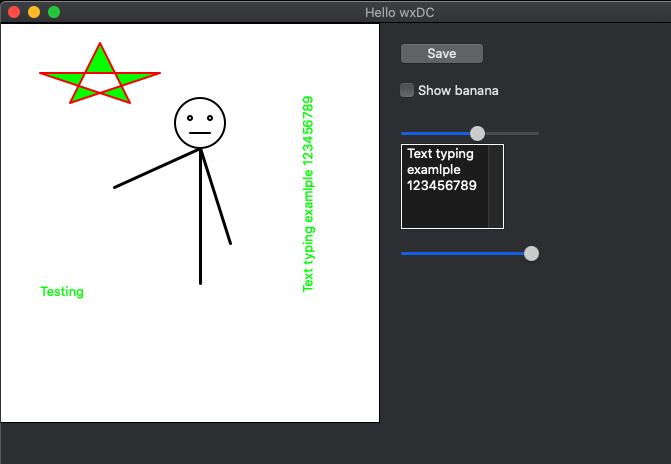

## WHAT IS IT

This repository contains project written in C++ using wxwidgets (https://www.wxwidgets.org/) library to build GUI app.

This one file cpp app has example of use:
- button
- event handlers
- drawing lines and shapes
- drawing text
- drawing changed text after typing to edit (wxT
- rendering after change some value to imitate movement
- saving to file

There is not everithing working and this is only for testing ideas and expanding skill in wxwidgets and c++

## SETUP

(On macos)
- install brew (https://brew.sh/)

(in terminal):

        brew install wxwidgets

## HOW TO RUN
copy this reposytory:

    git clone https://github.com/JackDaniells121/drawingPanel111.git
    cd drawingPanel111

(terminal command to generate executable):

        c++ -o program main.cpp `wx-config --cxxflags --libs`

)